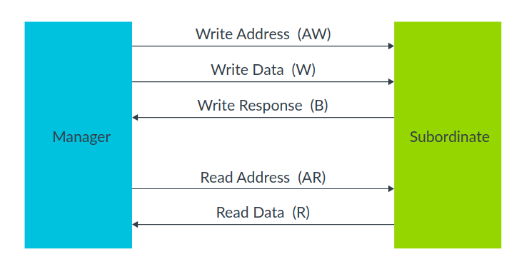

# axi_arbiter

## Introduction

An "academic exercise repo" to understand AXI (AXI-Lite, AXI) protocol and verification backend, through an AXI arbiter implementation.

References:
1.  AMBA AXI Protocol specification:  https://zipcpu.com/doc/axi-spec.pdf
2.  An Introduction to AMBA AXI:  https://developer.arm.com/documentation/102202/latest/
3.  Gisselquist Tutorials, example:  https://zipcpu.com/formal/2018/12/28/axilite.html
4.  Stuart Sutherland and Clifford Cummings papers, books.

## High level Overview of AXI(-Lite)
1.  It is a *point-to-point protocol*, not a bus specification.  That is, the protocol only specifies the signal and timing, i.e., it defines individual channel interfaces between master(s) [controller(s)/manager(s)] and slave(s) [peripheral(s)/subordinate(s)].  The arbitration and interconnect fabric (if present) is external to the protocol itself.
    - In AXI-Lite, this point-to-point model makes routing and arbitration simpler.
    - In full AXI, this becomes essential to support multiple outstanding transactions.

2.  The protocol consists of **five channels** as shown below.

	The "B" in Write Response stands for "buffered".

3.  Note that all channels are independent:  a write request can take place at the same time as a read request.  Hence, the B channel is necessary to inform the master that the write request is complete.  But a read response is issued in the same channel as read data.

4.  **FUNDAMENTAL CONCEPTS**:
    - **VALID/READY Handshake**:
      - The slave *may* wait for VALID to be asserted before assering READY, *but* the master **must not** wait for READY to assert VALID.  This is what gives the protocol asynchronous decoupling and flow control flexibility.
    - *Recommended*:  Register **all** outputs.  Best practice for timing closure, too-friendliness (CDC-aware design).
    - *Terminology*:  Transfer vs transaction:
      - A transfer is a single data beat (one VALID + READY = 1 transfer)
      - A transaction is a complete read or write sequence across one or more channels.
      	- In AXI-Lite:  every transaction is 1 transfer per channel.
	     - In full AXI:  transactions may span multiple transfers (bursts).

It is recommended to go through [AXI Arbiter Details](./doc/axi_arbiter_details.md) next.

